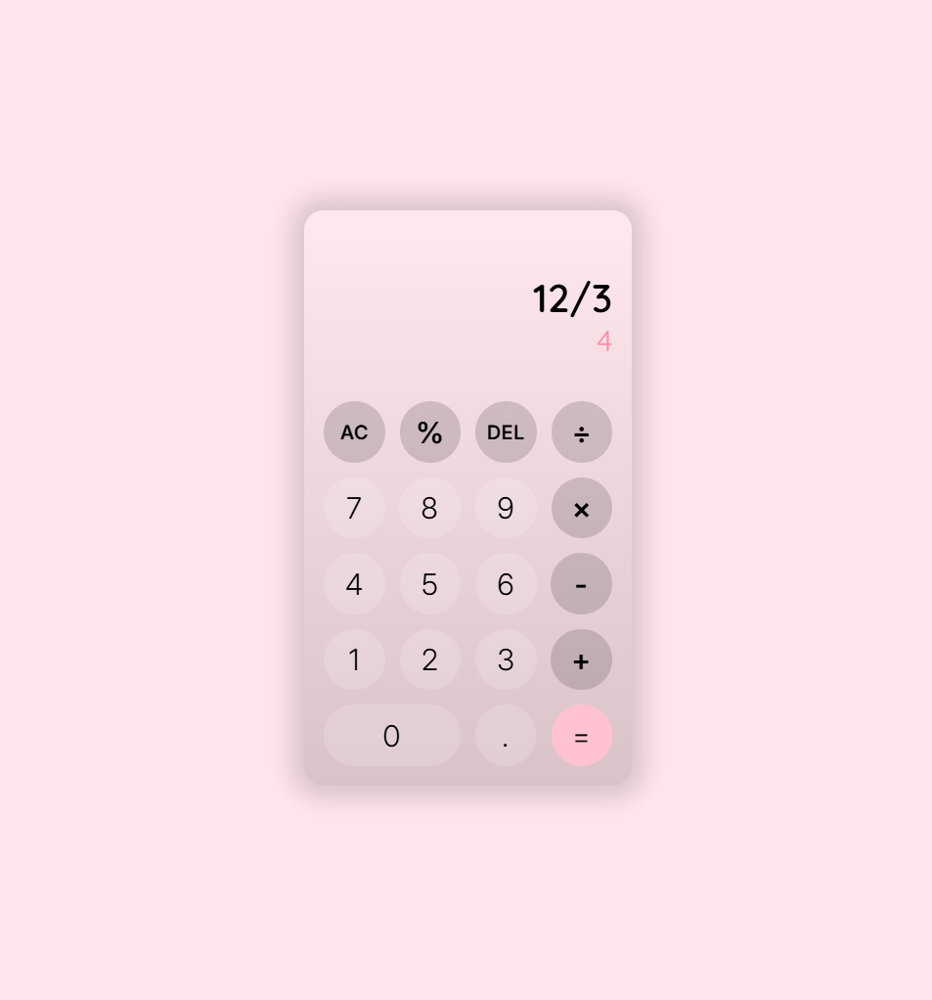

# Calculator App

A simple calculator application built with HTML, CSS, and JavaScript.

## Features

* Basic arithmetic operations

  * Addition (+)
  * Subtraction (-)
  * Multiplication (×)
  * Division (÷)
  * Percentage (%)
* Decimal number support
* Delete last character (DEL)
* Clear all input (AC)
* Error handling for invalid expressions
* Responsive calculator interface

## Technologies Used

* HTML5
* CSS3
* JavaScript (Vanilla JS)

## Preview



## Project Structure

```text
calculator-app/
│
├── index.html
├── style.css
├── script.js
├── README.md
│
└── assets/
    └── calculator.png
```

## Getting Started

1. Clone the repository:

```bash
git clone https://github.com/your-username/calculator-app.git
```

2. Open the project folder.

3. Run `index.html` in your browser.

## Future Improvements

* Keyboard support
* Dark/Light mode toggle
* Calculation history
* Scientific calculator functions

## Author

Shaghayegh
